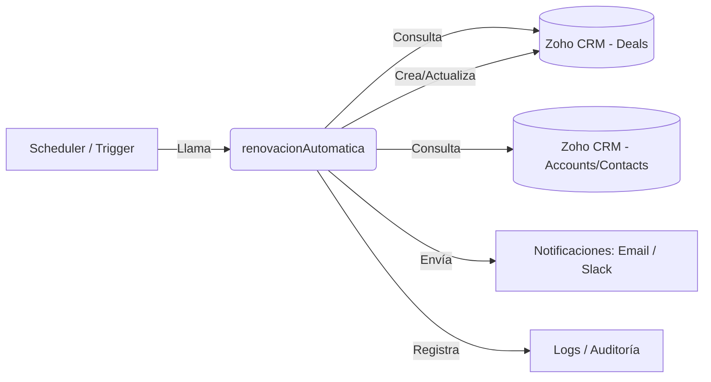
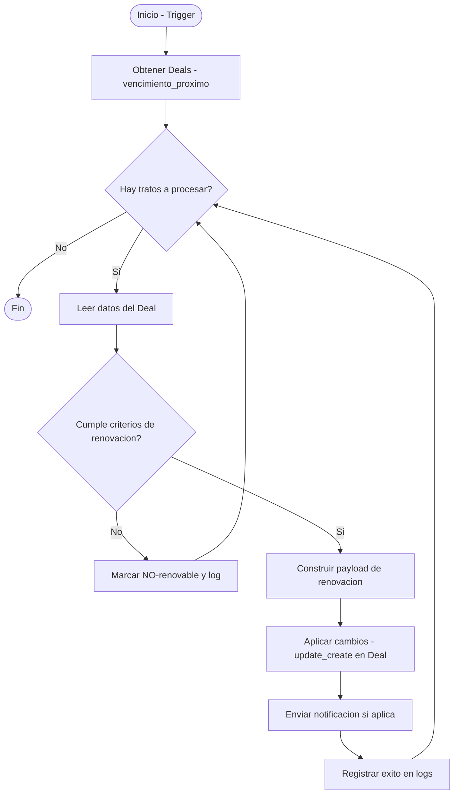

# Documentación Técnica — Script `renovacionAutomatica`

## Resumen
Este documento describe la funcionalidad, arquitectura y especificaciones técnicas del script `renovacionAutomatica`, encargado de automatizar la renovación de contratos/tratos en Zoho CRM según reglas de negocio (fechas de vencimiento y criterios configurables).

Objetivo: detectar tratos próximos a vencer, generar la acción de renovación (actualizar estado, crear tareas/contactos o enviar notificaciones) y registrar la operación para auditoría.

---

## 1. Diagrama de arquitectura

El diagrama muestra los componentes que intervienen: evento o programador (scheduler), acceso a Zoho CRM, lógica del script `renovacionAutomatica` y sistema de notificaciones / logs.



---

## 2. Diagrama de flujo lógico

Diagrama de flujo que describe la operación principal del script.



---

## 3. Especificaciones técnicas

### 3.1 Entradas
| Argumento / Fuente | Tipo | Obligatorio | Descripción |
|--------------------|------:|:-----------:|-------------|
| `vencimiento_window_days` | Int | Sí | Ventana en días para considerar un trato próximo a vencerse (ej. 30). |
| `filter_criteria` | Object | No | Filtros adicionales (p. ej. tipo de contrato, región). |
| `trigger` | String | Sí | Tipo de disparador: `scheduled` o `manual`. |

### 3.2 Salidas / Efectos
| Salida / Efecto | Tipo | Descripción |
|-----------------|------:|-------------|
| Actualización de `Deal` | API update | Cambios en campos: estado, fecha renovación, comentarios. |
| Creación de tareas / recordatorios | API create | Creación de tareas para encargados de renovación. |
| Notificaciones | Email/Slack | Mensajes enviados a responsables. |
| Registro de eventos | Log | Registro con resultado y metadata de la operación. |

### 3.3 Requisitos y dependencias
| Elemento | Detalle |
|---------|--------|
| Permisos API | Token/usuario con permisos de lectura/edición sobre `Deals` y creación en `Tasks` si se usan. |
| Conectividad | Acceso a la API de Zoho CRM y al servicio de notificaciones (SMTP / webhook). |
| Scheduler | Puede ejecutarse desde un cron externo, servicio serverless o workflow interno de la plataforma. |

---

## 4. Manejo de errores y logging
- Si la consulta inicial falla (API error): reintentar con backoff y notificar al administrador si persiste.
- Para cada `Deal` que falle al actualizar: registrar error detallado y continuar con el siguiente registro.
- Validar payloads antes de enviar updates para evitar fallos por datos inválidos.
- Mantener un log estructurado (timestamp, id_trato, acción, resultado, mensaje_error) para auditoría.

---

## 5. Pruebas sugeridas
- Caso base: Deal con fecha de vencimiento dentro de la ventana y que cumple criterios → verificar actualización y notificación.
- No renovable: Deal fuera de criterios → marcado como no renovable y sin acciones.
- Error en actualización: simular fallo en API y verificar reintentos y logging.
- Escalado: procesar lote grande para validar performance y límites de rate-limit.

---

## 6. Despliegue y monitoreo
- Desplegar primero en entorno de staging con datos de prueba.
- Programar ejecución (p. ej. diario a las 02:00) mediante cron/servicio.
- Monitorizar logs y métricas: número de tratos procesados, éxitos, fallos, latencia.
- Establecer alertas en caso de error sostenido o caída del job.

---

## 7. Notas operativas
- Guardar el token/API key en un secret manager (no en el código).
- Evitar operaciones destructivas masivas sin confirmación; preferir marcar y revisar antes de cambios masivos.
- Documentar cualquier campo personalizado que el script lea o actualice (nombres exactos de campos en Zoho CRM).

---

## 8. Pseudocódigo / Flujo resumido
(Pseudocódigo de alto nivel; el código real se versionará en el repositorio junto a esta documentación.)

```text
1. Conectar a Zoho CRM usando credenciales seguras
2. Consultar Deals con fecha_vencimiento <= hoy + vencimiento_window_days y que cumplan filter_criteria
3. Por cada Deal:
   a. Validar elegibilidad
   b. Preparar payload de renovación
   c. Aplicar update/create según reglas
   d. Enviar notificación si procede
   e. Registrar resultado en logs
4. Finalizar y reportar resumen de ejecución
```

---
